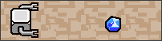
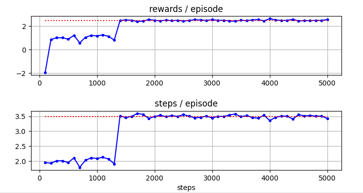
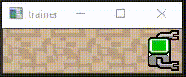

# iRL 強化学習プログラム


このiRLでは、簡単な強化学習タスクを体験することができます。

以下のコマンドで、タスクを自分でプレイすることができます。
short_roadの代わりに、long_roadを指定することもできます。
```
> python env_corridr.py short_road
```

操作方法が表示されますので、これに従ってプレイしてください。

```
---- 操作方法 -------------------------------------
[f] 右に進む
[d] 拾う
[q] 終了
クリスタルを拾うと成功
---------------------------------------------------
[task_type]: short_road
```

このタスクを強化学習にさせるには、以下のコマンドを実行します。

```
> python sim_corridr.py 
```

で以下のように使い方が表示されます。


```
---- 使い方 ---------------------------------------
2つのパラメータを指定して実行します
> python main_corridor.py [task_type] [process_type]

[task_type]     : short_road, long_road
[process_type]  :learn/L, more/M, graph/G, anime/A
例 > python main_corridor.py short_road L
---------------------------------------------------
```

task_type をshort_road に指定して実行するには以下のようにします。

```
> python main_corridor.py short_road L
```

学習はすぐに終わり、結果のグラフが表示されます。



以下のコマンドで、追加学習ができます。
```
> python main_corridor.py short_road M
```

以下のコマンドで、学習結果のアニメーションを見ることができます。

```
> python main_corridor.py short_road A
```



