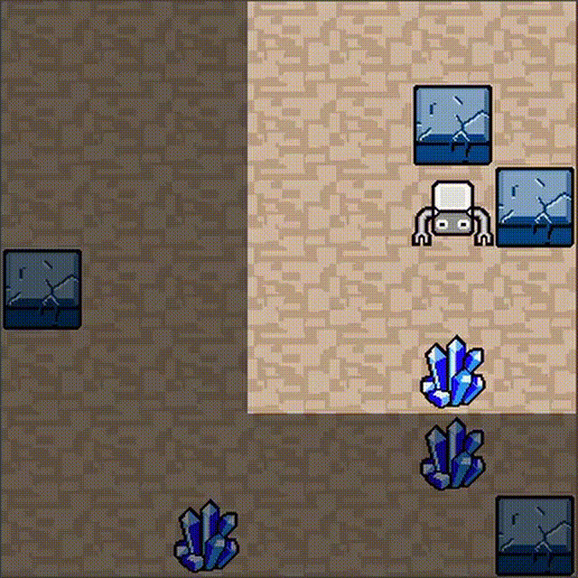

# iRL とは

このiRLでは、以下のような強化学習タスクを学習させることができます。GPUのない普通のノートPCで学習させることが可能です。筆者の古いノートPCでも4分弱しかかかりませんでした (netQ, random_wall, 33000 qstep, 3分40秒)。

※筆者のノートPCのCPUは、Intel Core i7-6600UでGPUなし。i7でも第6世代なので結構遅く、i5-7500Uの方が上のようです。 [参考：CPU性能比較表 | 最新から定番のCPUまで簡単に比較](https://pcrecommend.com/cpu/)

タスクは、ロボットを動かして全てのゴール（クリスタル）に訪れるとクリアというものです。マップはエピソード毎にランダムに生成されます。

ロボットは2マスまでの周囲しか見えない設定なのですが、「壁はよける」、「ゴールに近づいたらそちらに曲がる」、「何もなければまっすぐ進む」、のようなアルゴリズムで動いているように見えます。このアルゴリズムを強化学習が作りました。マップがランダムに変わっても、追加学習をすることなく対応しています。

