# iRL とは

このiRLでは、例えば、以下のような強化学習タスクを学習させることができます。GPUのない普通のノートPCで学習させることが可能です。筆者の古いノートPCでも4分弱しかかかりませんでした (netQ, four_crystals, 33000 qstep, 3分40秒)。

※筆者のノートPCのCPUは、Intel Core i7-6600UでGPUなし。i7でも第6世代なので結構遅く、i5-7500Uの方が上のようです。 [参考：CPU性能比較表 | 最新から定番のCPUまで簡単に比較](https://pcrecommend.com/cpu/)

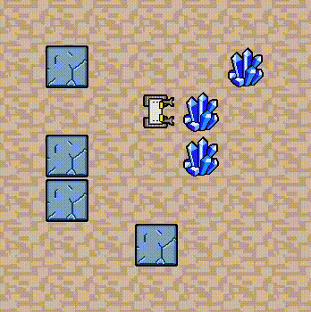

タスクは、ロボットを動かして全てのゴール（水晶）に訪れるとクリアというものです。マップはエピソード毎にランダムに生成されます。

ロボットは2マスまでの周囲しか見えない設定なのですが、「壁はよける」、「ゴールに近づいたらそちらに曲がる」、「何もなければまっすぐ進む」、のようなアルゴリズムで動いているように見えます。このアルゴリズムを強化学習が作ったのです。マップがランダムに変わっても、追加学習をすることなく対応しています。

このiRLプロジェクトでは、このタスクを含む7つのバリエーションのタスクを、4種類の強化学習エージェントで試すことができます。

学習の原理、実装方法など、更に詳しい解説は、以下を参考にしてください。

http://itoshi.main.jp/tech/0100-rl/rl_introduction/


# 環境構築

ここでは、windows 10 を想定し、pythonでiRLを動かすための環境構築を説明します。

## Anaconda インストール
まず、pythonの基本的な環境として、anaconda をインストールします。

参考
<a href="https://www.python.jp/install/anaconda/windows/install.html">Windows版Anacondaのインストール</a>

## 仮想環境作成
次に、特定のpythonのバージョンやモジュールのバージョンの環境を設定するために、conda で仮想環境を作成します。

参考
<a href="https://qiita.com/ozaki_physics/items/985188feb92570e5b82d">【初心者向け】Anacondaで仮想環境を作ってみる</a>
<a href="https://www.python.jp/install/anaconda/conda.html">python japan, Conda コマンド</a>

スタートメニューからAnaconda Powershell Prompt を立ち上げます。

以下のコマンドで、iRLという名前の仮想環境をpython3.6 で作成します。
```
(base)> conda create -n iRL python=3.6
```

以下で、iRLをアクティベートします（仮想環境に入る）。
```
(base)> conda activate iRL
```


tensorflow, numpy, h5py をバージョン指定でインストールします。
```
(iRL)> pip install tensorflow==1.12.0 numpy==1.16.1 h5py==2.10.0
```

opencv-pythonとmatplotlib は、最新のバージョンでインストールします。
```
(iRL)> pip install opencv-python matplotlib
```

今後、この仮想環境 iRL に入ることで(> conda activate iRL)、今インストールしたモジュール（ライブラリ）の環境で、プログラムを動かすことができます。

仮想環境から抜けるには以下のようにします。
```
(*iRL*)> conda deactivate
```

# iRLのダウンロードと展開

gitが使える方は、以下のコマンドでクローンすれば完了です。
```
(iRL)> git clone https://github.com/itoshin-tech/iRL.git
```

以下、git を使っていない人用の説明です。

ブラウザで、次ののURLに行きます（このHPです）。
https://github.com/itoshin-tech/iRL

Code から、Download zip を選び、PCの適当な場所(C:\myWorks\ を想定)に保存して解凍すると、iRL-main というフォルダが作られます

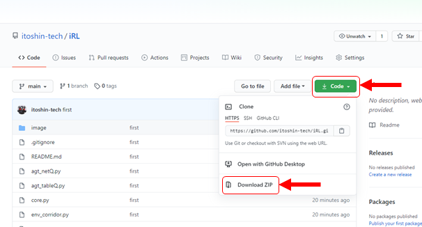


これで準備ＯＫです。

# iRLの実行

iRLを展開したフォルダーに入ります。
```
(iRL)> cd C:\[解凍したディレクトリ]\iRL-main\  
```

sim_crystal.py を以下のコマンドで実行します。
```
> python sim_crystal.py
```

すると以下のように使い方が表示されます。
```
---- 使い方 ---------------------------------------
3つのパラメータを指定して実行します

> python sim_crystal.py [agt_type] [task_type] [process_type]

[agt_type]      : tableQ, netQ
[task_type]     : fixed_field, open_field, four_crystals
[process_type]  :learn/L, more/M, graph/G, anime/A
例 > python sim_crystal.py tableQ open_field L
---------------------------------------------------
```

説明にあるように、python sim_crystal.py の後に3つのパラメータをセットして使います。

最後に図解しますので、ここでは簡単に説明します。

+ [agt_type]　強化学習のアルゴリズムを指定します。
  + tableQ: Q学習
  + netQ: ニューラルネットを使ったQ学習
+ [task_type]　タスクのタイプ。全てのタスクにおいて全ての青いゴールに辿り着けばクリア
  + fixed_field: マップ固定、ゴール数2
  + open_field: 壁なし、ゴール数1。ゴールの位置はランダムに変わる。
  + four_crystals: 壁あり、ゴール数4。配置がランダムに変わる。
+ [process type] プロセスの種類
  + learn/L: 初めから学習する
  + more/M: 追加学習をする
  + graph/G: 学習曲線を表示する
  + anime/A: タスクを解いている様子をアニメーションで表示

以下、<strong class="marker-yellow">netQ</strong> (ニューラルネットを使ったQ学習) に <strong class="marker-yellow">four_crystals</strong> のタスクを学習させる場合を説明します。

学習を開始するので、最後のパラメータは、<strong class="marker-yellow">more か L</strong>にします。

```
(iRL)> python sim_crystal.py netQ four_crystals L
```

すると、以下のようにコンソールに学習過程の評価が表示され、全5000 stepの学習が行われます。
```
netQ four_crystals  1000 --- 5 sec, eval_rwd -3.19, eval_steps  30.00
netQ four_crystals  2000 --- 9 sec, eval_rwd -0.67, eval_steps  28.17
netQ four_crystals  3000 --- 14 sec, eval_rwd -0.21, eval_steps  26.59
netQ four_crystals  4000 --- 18 sec, eval_rwd -1.27, eval_steps  28.72
netQ four_crystals  5000 --- 23 sec, eval_rwd -1.29, eval_steps  28.90
```

1000回に1回、評価のプロセスがあり、そこで、eval_rwdとeval_stepが計算されます。eval_rwd は、その時の1エピソード中の平均報酬(reward/episode)、eval_steps は平均step数(steps/episode)です。評価は、行動選択のノイズは0にして行われます。

最後に以下のような学習過程のグラフ（reward/episode, steps/episode）が表示されます。赤い点線は目標値です。reward/episodeが赤い線に達し、steps/spisode１が赤い線まで下がると、学習がほぼ完了したことになります。今の段階では、学習は十分ではないことが分かります。

[q]を押すとグラフが消え終了します。

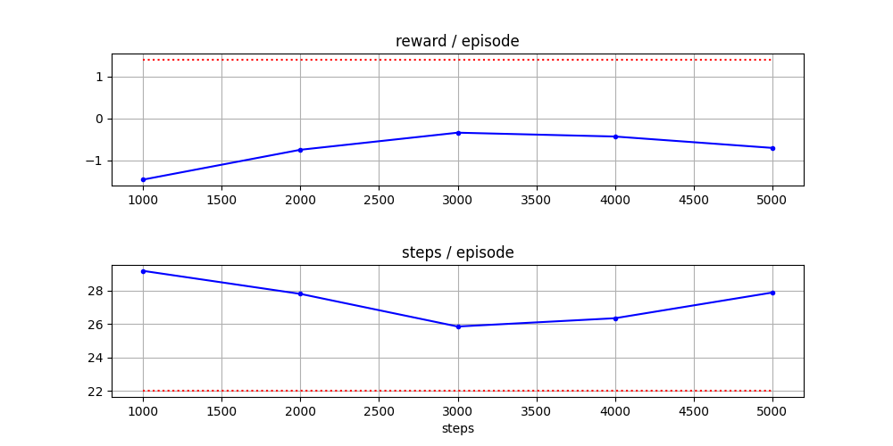

学習の結果後の<strong class="marker-yellow">動作アニメーションを見る</strong>には、最後のパラメータを<strong class="marker-yellow">anime か A</strong>にします。

```
(iRL)> python sim_crystal.py netQ four_crystals A
```
すると、以下のようなアニメーションが表示されます。
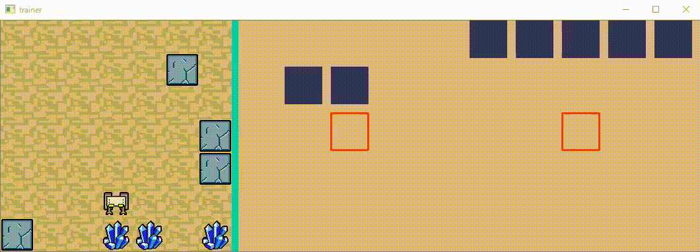

100エピソードが終わると終了します。[q]を押すと途中終了します。

アニメーションを見ると、予想通り、適切に動けていなことが分かります。まだ学習が足りないのです（アニメーションの中央から右側の白黒の図はエージェントへの入力を表しています）。

そこで、<strong class="marker-yellow">追加学習</strong>します。最後のパラメータを<strong class="marker-yellow">more か M</strong>にして実行します（初めから学習する場合は L を使います）。

```
(iRL)> python sim_crystal.py netQ four_crystals M
```
　
このコマンドを数回繰り返し、グラフが目標値付近に到達するまで続けます。

```
netQ four_crystals  1000 --- 4 sec, eval_rwd  0.75, eval_steps  24.45
netQ four_crystals  2000 --- 9 sec, eval_rwd  0.92, eval_steps  23.90
netQ four_crystals  3000 --- 14 sec, eval_rwd  1.38, eval_steps  22.24
netQ four_crystals  4000 --- 19 sec, eval_rwd  1.60, eval_steps  21.54
netQ four_crystals  5000 --- 23 sec, eval_rwd  1.76, eval_steps  21.03
```

7回目のグラフです。エピソード当たりの報酬(rwd)が増加し、ステップ数(Steps)が減少していることから、学習が進んでいたことが分かります。

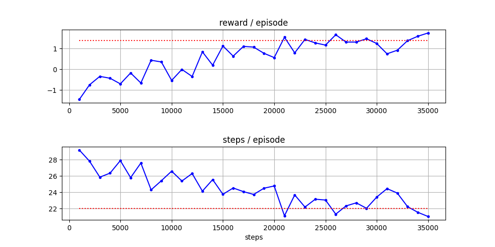

アニメーションを見てみましょう。

```
(iRL)> python sim_crystal.py netQ four_crystals A
```

たまに失敗しますが、だいたいうまくいっているようです。

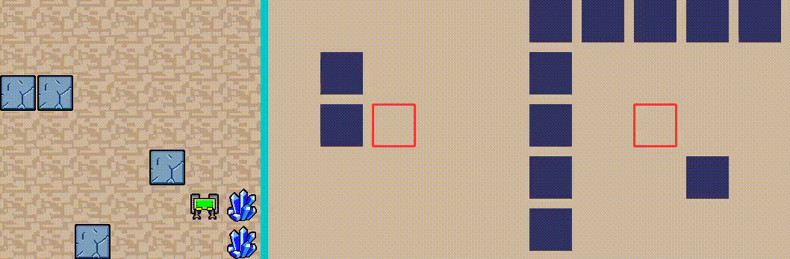

今までに学習させた<strong class="marker-yellow">グラフをもう一度表示</strong>するには、最後のパラメータを<strong class="marker-yellow">graph か G</strong>にします。

```
(iRL)> python sim_crystal.py netQ four_crystals G
```


以上がsim_crystal.py（池巡り）の使い方の説明です。

# 強化学習アルゴリズムの種類

[agt_type] で指定できる強化学習アルゴリズム（エージェント）は、 tableQ, netQ の2種類です。ここではその特徴を簡単に説明します。

## tableQ：通常のQ学習 
基本の<strong class="marker-yellow">Q学習アルゴリズム</strong>です。各観察に対して各行動のQ値を変数（Qテーブル）に保存し、更新していきます。観測値は500個まで登録できる設定にしています。それ以上のパターンが観測されたらメモリーオーバーで強制終了となります。

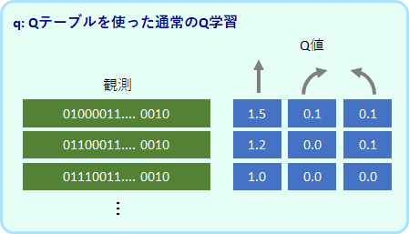

## netQ：ニューラルネットを使ったQ学習アルゴリズム
<strong class="marker-yellow">ニューラルネットワーク</strong>でQ値を出力するよう学習します。入力は観測値で、出力は3つ値です。この3つの値が各行動のQ値に対応します。中間層は64個のReLUユニットです。
未知の観測値に対してもQ値を出力することができます。

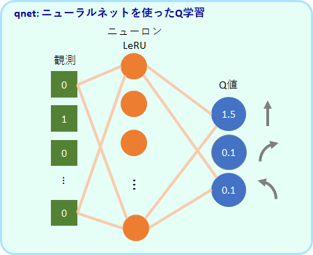


# タスクの種類
[task_type] で指定できるタスクは、fixed_field, open_field, four_crystals, Tmaze_both, Tmaze_either, ruin_1swamp, ruin2swamp の7種類です。ここではその特徴を簡単に説明します。

## 全タスクで共通のルール

全てのタスクで共通しているのは、ロボットが<strong class="marker-yellow">全てのゴール（青のマス）に訪れたらクリア</strong>、というルールです。

アルゴリズムが受け取る情報は、<strong class="marker-yellow">ロボットを中心とした、限られた視野におけるゴールと壁の情報</strong>です。各タスクの図の、右側の白黒の図がその情報に対応します。

報酬は、初めてのゴールにたどり着くと+1.0、壁に当たると-0.2、それ以外のステップで-0.1となります。

## silent_ruin

ゴールは2か所ありますが、マップは常に同じです。そのために、観測のバリエーションは限られており、q でも学習が可能です。

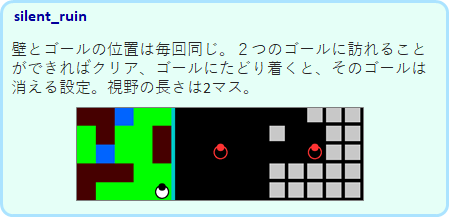


## open_field

壁はありませんが、ゴールの場所はエピソード毎にランダムに変わります。しかし、壁がないので観測のバリエーションは限られており、qでも学習が可能です。

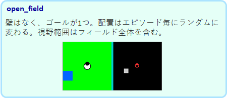

## four_crystals

ゴールと壁の位置がエピソード毎にランダムに決まるために、観測のバリエーションが多く、qではメモリーオーバーとなってしまい学習ができません。netQ での学習が可能です。

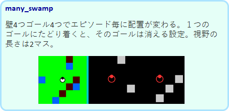


# 参考
学習の原理、実装方法など、更に詳しい解説は、以下を参考にしてください。

http://itoshi.main.jp/tech/0100-rl/rl_introduction/

